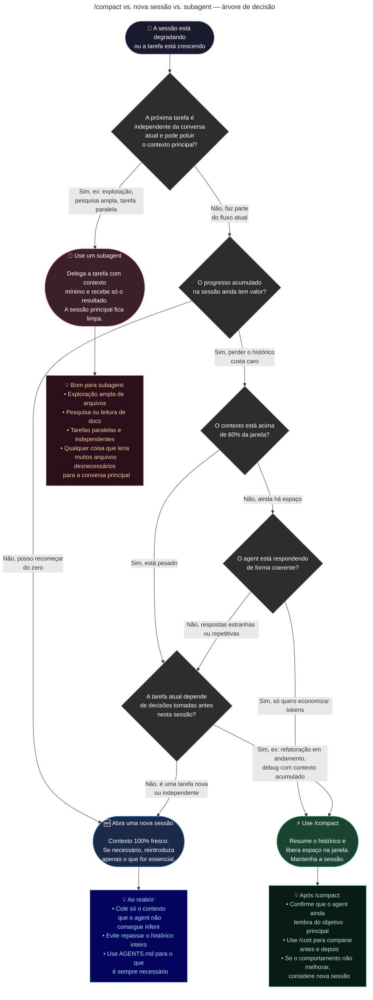

# /compact vs. nova sessão vs. subagent — árvore de decisão

```mermaid
---
title: /compact vs. nova sessão vs. subagent — árvore de decisão
---
flowchart TD
    START([🧠 A sessão está degradando<br/>ou a tarefa está crescendo]) --> Q0

    Q0{A próxima tarefa é<br/>independente da conversa<br/>atual e pode poluir<br/>o contexto principal?}
    Q0 -- Sim, ex: exploração,<br/>pesquisa ampla, tarefa paralela --> SUBAGENT
    Q0 -- Não, faz parte<br/>do fluxo atual --> Q1

    Q1{O progresso acumulado<br/>na sessão ainda tem valor?}
    Q1 -- Não, posso recomeçar<br/>do zero --> NOVA
    Q1 -- Sim, perder o histórico<br/>custa caro --> Q2

    Q2{O contexto está acima<br/>de 60% da janela?}
    Q2 -- Não, ainda há espaço --> Q3
    Q2 -- Sim, está pesado --> Q4

    Q3{O agent está respondendo<br/>de forma coerente?}
    Q3 -- Sim, só quero economizar tokens --> COMPACT
    Q3 -- Não, respostas estranhas ou repetitivas --> Q4

    Q4{A tarefa atual depende<br/>de decisões tomadas antes<br/>nesta sessão?}
    Q4 -- Sim, ex: refatoração em andamento,<br/>debug com contexto acumulado --> COMPACT
    Q4 -- Não, é uma tarefa nova<br/>ou independente --> NOVA

    SUBAGENT(["🤖 Use um subagent<br/><br/>Delega a tarefa com contexto<br/>mínimo e recebe só o resultado.<br/>A sessão principal fica limpa."])
    COMPACT(["⚡ Use /compact<br/><br/>Resume o histórico e<br/>libera espaço na janela.<br/>Mantenha a sessão."])
    NOVA(["🆕 Abra uma nova sessão<br/><br/>Contexto 100% fresco.<br/>Se necessário, reintroduza<br/>apenas o que for essencial."])

    SUBAGENT --> DICA_S
    COMPACT --> DICA_C
    NOVA --> DICA_N

    DICA_S["💡 Bom para subagent:<br/>• Exploração ampla de arquivos<br/>• Pesquisa ou leitura de docs<br/>• Tarefas paralelas e independentes<br/>• Qualquer coisa que leria<br/>  muitos arquivos desnecessários<br/>  para a conversa principal"]

    DICA_C["💡 Após /compact:<br/>• Confirme que o agent ainda<br/>  lembra do objetivo principal<br/>• Use /cost para comparar<br/>  antes e depois<br/>• Se o comportamento não melhorar,<br/>  considere nova sessão"]

    DICA_N["💡 Ao reabrir:<br/>• Cole só o contexto<br/>  que o agent não consegue inferir<br/>• Evite repassar o histórico inteiro<br/>• Use AGENTS.md para o que<br/>  é sempre necessário"]

    style START fill:#1a1a2e,color:#fff,stroke:#4a4e8c
    style SUBAGENT fill:#3b1f2b,color:#fff,stroke:#e07a5f
    style COMPACT fill:#1b4332,color:#fff,stroke:#52b788
    style NOVA fill:#1c2a4a,color:#fff,stroke:#4895ef
    style DICA_S fill:#2a0e1a,color:#f2cc8f,stroke:#e07a5f
    style DICA_C fill:#081c15,color:#b7e4c7,stroke:#52b788
    style DICA_N fill:#03045e,color:#90e0ef,stroke:#4895ef
    style Q0 fill:#2d2d2d,color:#fff,stroke:#888
    style Q1 fill:#2d2d2d,color:#fff,stroke:#888
    style Q2 fill:#2d2d2d,color:#fff,stroke:#888
    style Q3 fill:#2d2d2d,color:#fff,stroke:#888
    style Q4 fill:#2d2d2d,color:#fff,stroke:#888
```
